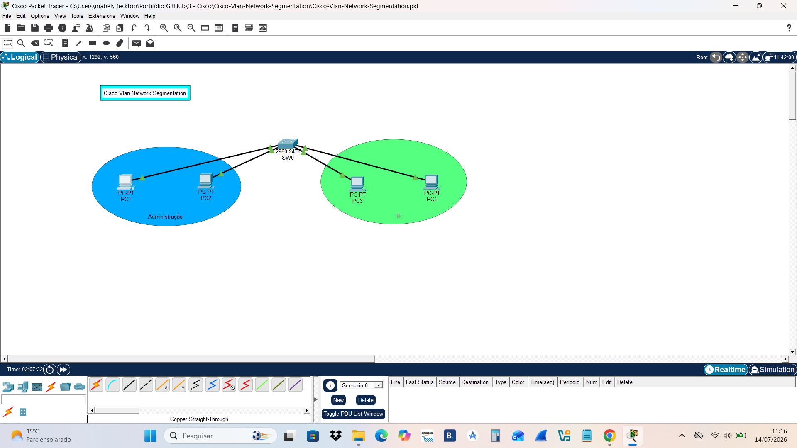
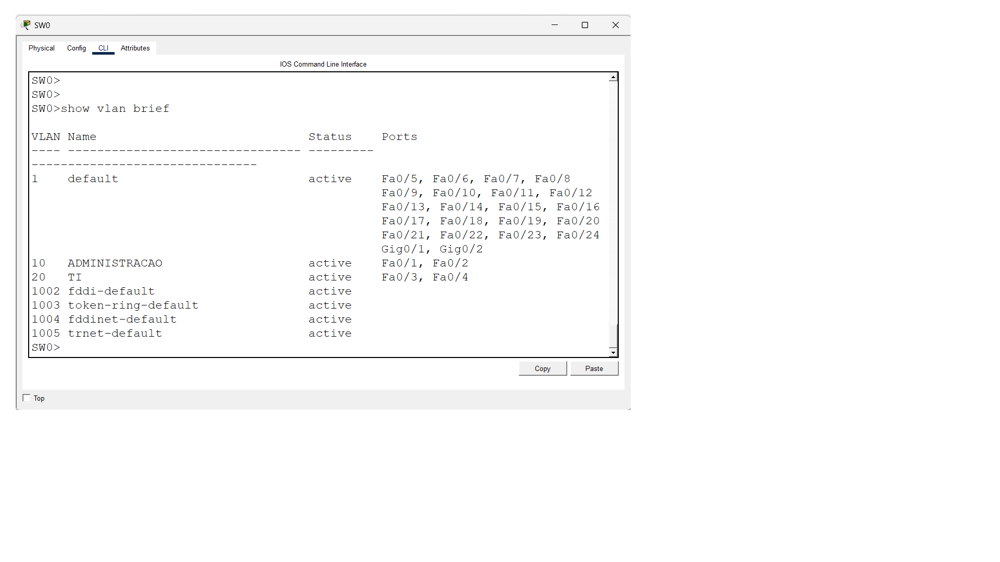
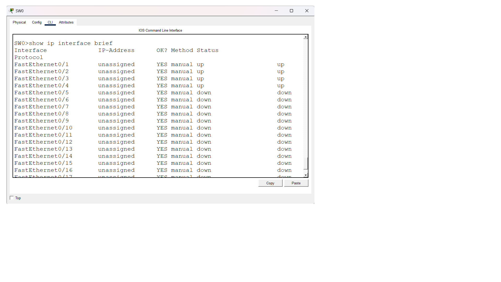
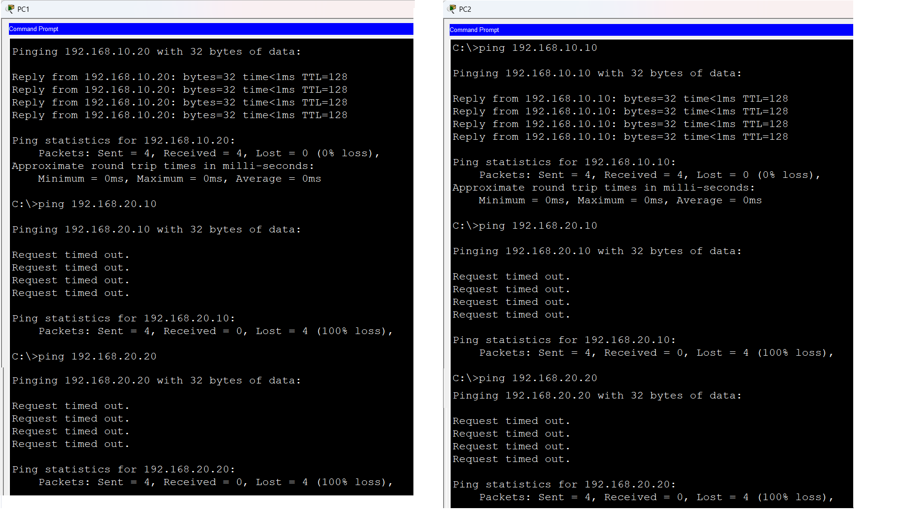
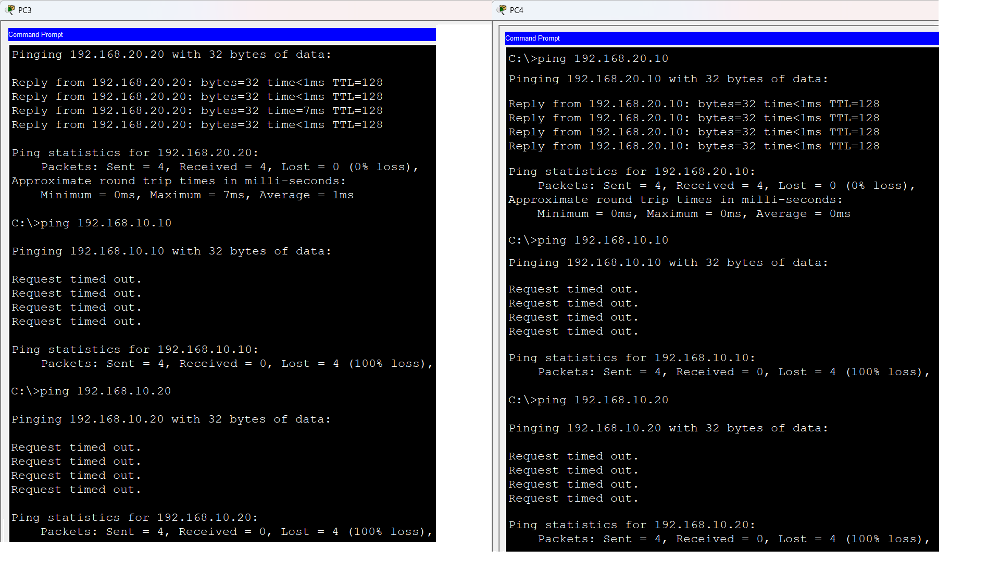

# 🔐 Segmentação de Rede utilizando VLANs - Cisco



## 📌 Sobre o projeto

Este projeto apresenta a configuração de uma rede utilizando **VLANs em um switch Cisco Catalyst 2960**, com o objetivo de realizar a segmentação da rede por departamentos, reduzir o domínio de broadcast e melhorar a organização da infraestrutura.

A implementação foi realizada utilizando o **Cisco Packet Tracer**.

---

# 🖥️ Topologia da Rede

## Equipamentos utilizados

- 1 Switch Cisco Catalyst 2960
- 4 Computadores
- Cabos Copper Straight-Through

## Distribuição dos dispositivos

| Dispositivo | Porta Switch | VLAN    | Departamento  | IP            |
| ----------- | ------------ | ------- | ------------- | ------------- |
| PC1         | Fa0/1        | VLAN 10 | Administração | 192.168.10.10 |
| PC2         | Fa0/2        | VLAN 10 | Administração | 192.168.10.20 |
| PC3         | Fa0/3        | VLAN 20 | TI            | 192.168.20.10 |
| PC4         | Fa0/4        | VLAN 20 | TI            | 192.168.20.20 |

---

# 🌐 Estrutura das VLANs

| VLAN | Nome          | Objetivo                                     |
| ---- | ------------- | -------------------------------------------- |
| 10   | ADMINISTRACAO | Separar dispositivos do setor administrativo |
| 20   | TI            | Separar dispositivos do setor de tecnologia  |

Cada VLAN representa um **domínio de broadcast independente**.

---

# ⚙️ Configurações realizadas

## 1. Configuração do hostname

```bash
enable
configure terminal
hostname SW0
```

---

## 2. Criação das VLANs

```bash
vlan 10
name ADMINISTRACAO
exit

vlan 20
name TI
exit
```

---

## 3. Configuração das portas de acesso

### VLAN 10 - Administração

Portas:

- Fa0/1
- Fa0/2

Configuração:

```bash
interface range fastEthernet 0/1-2
switchport mode access
switchport access vlan 10
exit
```

---

### VLAN 20 - TI

Portas:

- Fa0/3
- Fa0/4

Configuração:

```bash
interface range fastEthernet 0/3-4
switchport mode access
switchport access vlan 20
exit
```

---

# 🔎 Verificação das configurações

## Visualização das VLANs

Comando:

```bash
show vlan brief
```

Resultado:



---

## Verificação das portas

Comando:

```bash
show interfaces status
```

Resultado:



---

# 🧪 Testes de Conectividade

Após a configuração das VLANs, foram realizados testes de comunicação para validar a segmentação da rede.

Os testes tiveram como objetivo verificar:

- Comunicação entre dispositivos da mesma VLAN;
- Bloqueio da comunicação entre VLANs diferentes;
- Separação dos domínios de broadcast.

---

## VLAN 10 - Administração

| Origem | Destino | Resultado |
|---|---|---|
| PC1 | PC2 | ✅ Comunicação permitida |
| PC1 | PC3 | ❌ Bloqueado (VLAN diferente) |
| PC1 | PC4 | ❌ Bloqueado (VLAN diferente) |
| PC2 | PC1 | ✅ Comunicação permitida |
| PC2 | PC3 | ❌ Bloqueado (VLAN diferente) |
| PC2 | PC4 | ❌ Bloqueado (VLAN diferente) |

### Evidência do teste



---

## VLAN 20 - TI

| Origem | Destino | Resultado |
|---|---|---|
| PC3 | PC4 | ✅ Comunicação permitida |
| PC3 | PC1 | ❌ Bloqueado (VLAN diferente) |
| PC3 | PC2 | ❌ Bloqueado (VLAN diferente) |
| PC4 | PC3 | ✅ Comunicação permitida |
| PC4 | PC1 | ❌ Bloqueado (VLAN diferente) |
| PC4 | PC2 | ❌ Bloqueado (VLAN diferente) |

### Evidência do teste



---

## Resultado dos testes

✅ Dispositivos pertencentes à mesma VLAN conseguem se comunicar.

❌ Dispositivos em VLANs diferentes não conseguem se comunicar, pois não existe roteamento entre as redes.

A segmentação através de VLANs criou domínios de broadcast independentes, isolando os departamentos Administração e TI.

---

# 💾 Salvando a configuração

Comando utilizado:

```bash
copy running-config startup-config
```

---

# 📚 Conceitos aplicados

- VLAN (Virtual Local Area Network)
- Segmentação de rede
- Domínio de broadcast
- Switch Cisco Catalyst 2960
- Cisco IOS CLI
- Configuração de portas de acesso
- Testes de conectividade

---

# 🛠️ Ferramentas utilizadas

- Cisco Packet Tracer
- Cisco Catalyst 2960
- IPv4
- VLAN

---

# 👨‍💻 Autor

Alexandre Vaz

Projeto desenvolvido para estudos de Redes de Computadores e preparação profissional em infraestrutura de TI.
